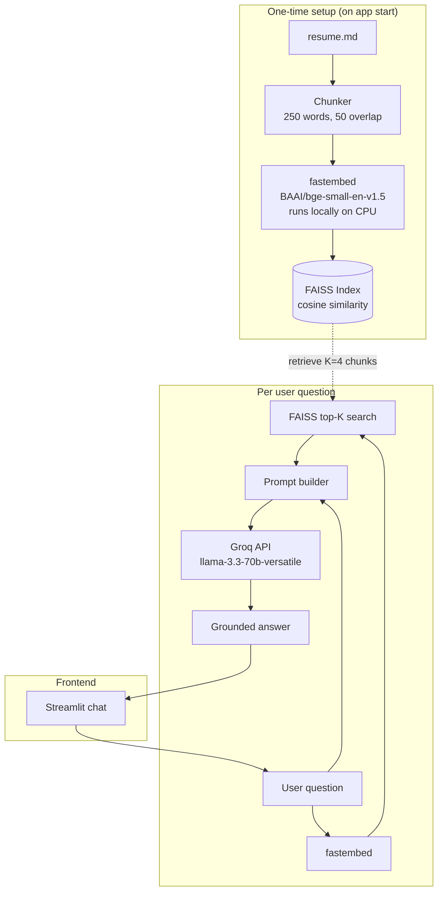
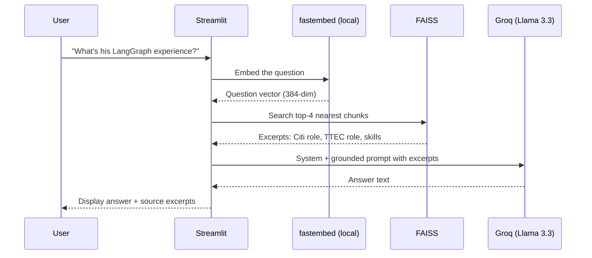

# Ask My Resume

A RAG (Retrieval-Augmented Generation) chatbot grounded in my resume. Ask it anything about my professional background and it returns accurate, citation-backed answers using Groq (Llama 3.3 70B), local fastembed embeddings, and FAISS.

Built as a hands-on demonstration of the production RAG pattern I use at scale at Citi, compressed into ~150 lines of Python. 100% free to run.

## Demo

```
You: What's his experience with LangGraph?
Bot: Abhinav has built production LangGraph systems at Citi, where he designed a
     supervisor + sub-agent topology for the Stylus Workspaces platform...
     [cites Excerpt 2, 4]
```

## Architecture



## Data flow (one question, step by step)



## Tech stack

| Layer | Choice | Why |
|-------|--------|-----|
| LLM | Groq (llama-3.3-70b-versatile) | Free API, sub-second latency, strong reasoning |
| Embeddings | fastembed (BAAI/bge-small-en-v1.5) | Runs locally, no API key, ONNX-based (fast on CPU) |
| Vector store | FAISS (local, in-memory) | Zero infra; perfect for single-doc demos |
| Frontend | Streamlit | 5-line chat UI from raw Python |
| Chunking | Sliding window, 250 words, 50 overlap | Preserves boundary-crossing facts |

## Run it locally

### 1. Clone and enter the project

```powershell
git clone https://github.com/<your-username>/ask-my-resume.git
cd ask-my-resume
```

### 2. Create a virtual environment

**Windows (PowerShell):**
```powershell
python -m venv .venv
.venv\Scripts\Activate.ps1
```

**macOS / Linux:**
```bash
python3 -m venv .venv
source .venv/bin/activate
```

### 3. Install dependencies

```powershell
pip install -r requirements.txt
```

### 4. Add your API key

Copy `.env.example` to `.env` and fill in your key:

```
GROQ_API_KEY=gsk-...
```

Get a free Groq API key at https://console.groq.com/keys — sign up with Google, no credit card required. The embedding model runs locally so no embedding API key is needed.

### 5. Run

```powershell
streamlit run app.py
```

Opens in your browser at `http://localhost:8501`.

## Project structure

```
ask-my-resume/
├── app.py             # The whole app (~150 lines)
├── resume.md          # The resume content being indexed
├── requirements.txt   # Python dependencies
├── .env.example       # Template for API keys (commit this)
├── .env               # Your actual keys (gitignored)
├── .gitignore
└── README.md
```

## How RAG works (the short version)

1. **Chunk** — split the resume into overlapping 250-word windows.
2. **Embed** — turn each chunk into a 1024-dimensional vector that captures its meaning.
3. **Index** — store all vectors in FAISS for fast similarity search.
4. **Retrieve** — on each question, embed it the same way and find the 4 most similar chunks.
5. **Generate** — paste those 4 chunks into Claude's prompt and ask it to answer using only that context.

The whole point of RAG: the model never hallucinates because it can only answer from what was retrieved. Every claim is anchored to a real chunk of source text.

## What this demonstrates

This project covers the full RAG pattern in production form, just compressed to one document:
- Document ingestion + chunking strategy
- Embedding generation
- Vector similarity search
- Grounded prompt construction
- Source citation in the UI
- Frontend wrapping for end users

The same architecture, at scale, becomes systems like the agentic platform I work on at Citi — just with Pinecone instead of FAISS, hybrid BM25+vector instead of pure dense, and cross-encoder re-ranking added before the LLM call.

## License

MIT
